# Scripts for hourly rainfall quality control

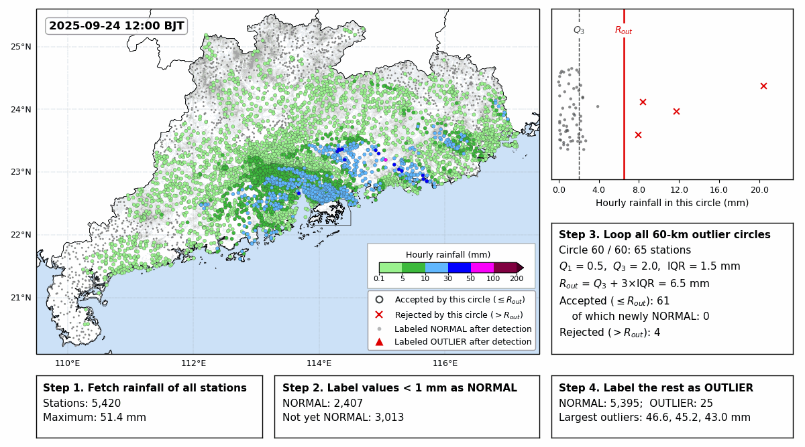
*Stage 1, outlier identification (Guangdong, 2025-09-24 12:00 BJT): the 60-km outlier circles slide over the province;
in each, values up to the fence Rout = Q3 + 3·IQR are accepted as NORMAL, and the values no
circle accepts are labeled OUTLIER.*

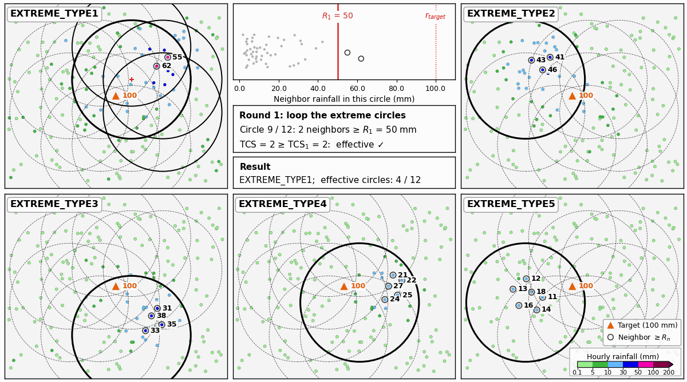
*Stage 2, extreme inspection (schematic): the 80-km extreme circles containing an outlier are checked round by round;
a circle is effective when enough neighbors reach Rn = CCn × rtarget, and the
round of the first effective circle gives the label EXTREME_TYPE1–5.*

## Description
This repository implements the iterative spatial consistency quality control (QC) method for hourly
rainfall proposed in the manuscript below, and reproduces its parameter tuning, validation, benchmark
and figures from the demonstration data included here. It is meant to help others understand the
method and apply it to their own gauge networks: the method itself is in `src/qc_algorithms.py`.

The original hourly archive is stored in an Oracle database that is not publicly accessible. The scripts
that extract data from the database, cache the neighbor rainfall, and apply the method to the full
archive are therefore not included; their outputs needed by the published scripts are included
(see [Data availability](#data-availability)).

The method and results are described in the manuscript *"An Iterative Spatial Consistency
Quality Control Method for In Situ Hourly Rainfall Observations"*, submitted to the
*Journal of Hydrometeorology* (JHM). A summary of the method, workflow, and key results is
given below; the figures referenced here are reproduced from the manuscript in
[`manuscript_figures/`](manuscript_figures/).

## Method overview

Existing spatial-consistency QC methods pool all neighboring observations into a single
ordered sequence and compare the target against one fixed threshold in a single pass. This
tends to misclassify genuine localized extreme rainfall as erroneous. This project proposes
a two-stage **iterative spatial consistency QC method** that instead treats each neighboring
station as an independent line of evidence and relaxes its acceptance criterion over several
rounds:

1. **Stage 1 — Outlier identification.** For each target hour, outlier circles (60 km) are used
   to compute a one-sided IQR fence `P_max = Q3 + k·IQR` (k = 3) from co-temporal neighbor
   observations. Values up to `P_max` (and all values below 1 mm) are accepted as normal; the
   rest are flagged as outliers for Stage 2.
2. **Stage 2 — Extreme inspection.** Each outlier is checked against the records of individual
   neighboring stations in sliding ("extreme") circles. A total confidence score (TCS) is
   accumulated from qualifying neighbors and compared against an iteration-specific threshold.
   - Outliers of **20 mm or more**: iterative inspection with 80-km circles, neighbors within
     ±2 h, and up to 5 rounds with relaxing criteria (confidence coefficient 0.5 → 0.1, TCS
     threshold 2 → 6). An outlier that clears round *i* is labeled `EXTREME_TYPEi`.
   - Outliers **below 20 mm**: a single strict check (first-round criteria only, 20-km circles,
     same-hour neighbors), because relaxed criteria would let small errors be corroborated by
     ordinary light rain.

   An outlier that never clears the threshold is labeled `FALSE`.

A complementary **temporal-consistency step** then flags as erroneous the false records of
20 mm or more confirmed within the station malfunction periods during data preparation, whatever
label the spatial QC gave them (some are corroborated by neighbors and accepted).

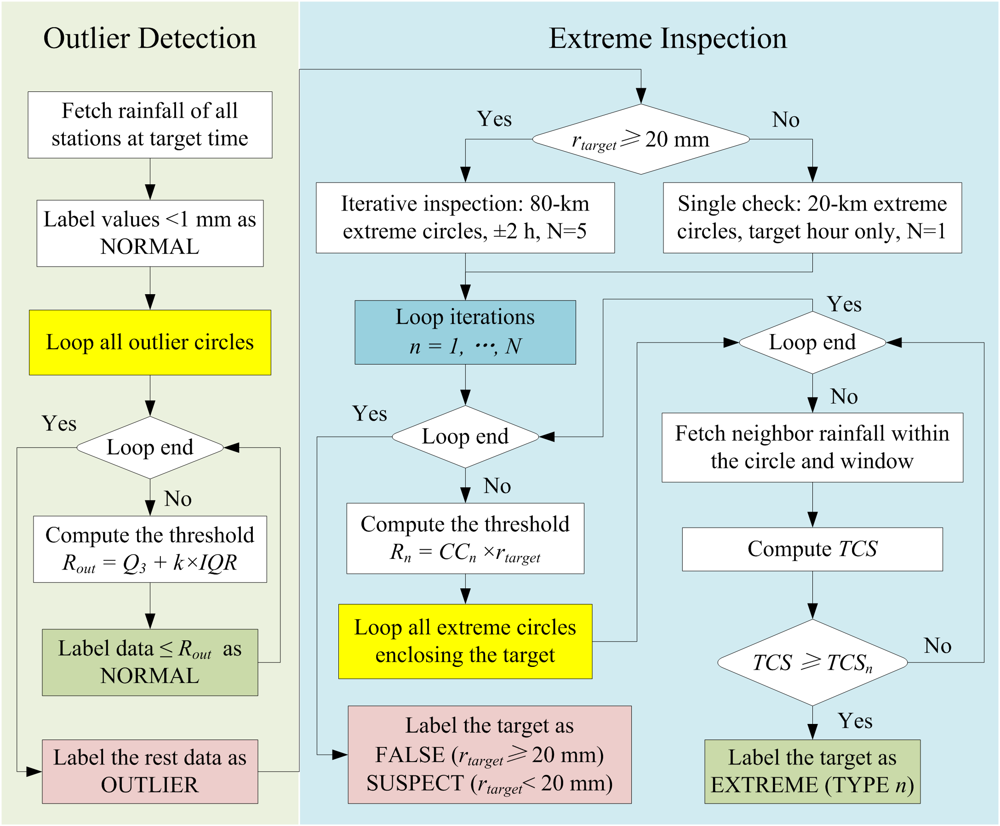
*Flow chart of the QC method: stage 1 (outlier identification) and stage 2 (iterative inspection ≥ 20 mm, single check < 20 mm).*

### Labeled data
NMO records ≥ 1 mm (2003–2025) are true; AWS records above the climatological limit
(184.4 mm h⁻¹) are false, and so are AWS records ≥ 1 mm within station malfunction periods,
which are derived objectively from the exceedances (consecutive exceedances at a station at most
14 days apart form one period) and kept only where all national observatories within 30 km
were dry. True records below 50 mm are downsampled to 600 per bin; the 5,007 samples
(4,515 true; 492 false) are split 6:4 into a training set (3,005) and a test set (2,002).

### Tuned parameters

| Parameter | Value |
|---|---|
| Outlier circle radius / step | 60 km / 0.6° |
| IQR multiplier k | 3 |
| Extreme circle radius / step (≥ 20 mm) | 80 km / 0.4° |
| Neighboring validation window (≥ 20 mm) | target hour ± 2 h |
| Iterations (≥ 20 mm) | 5 |
| Initial confidence coefficient / step | 0.5 / −0.1 |
| Initial TCS threshold / step | 2 / +1 |
| Single check below 20 mm | 20 km / 0.1°, target hour only, 1 round |

### Validation performance (independent test set, n = 2,002)

| Records | FP | FN | TP | TN | Sensitivity | Specificity |
|---|---|---|---|---|---|---|
| < 20 mm | 4 | 21 | 699 | 43 | 0.971 | 0.915 |
| ≥ 20 mm | 10 | 5 | 1,081 | 139 | 0.995 | 0.933 |
| All | 14 | 26 | 1,780 | 182 | 0.986 | 0.929 |

The Madsen–Allerup check with a tuned threshold (k = 80) rejected 90 genuine test records and
accepted 7 false ones. The method was applied to ~425 million AWS hourly records (2003–2025); values below 5 mm were
accepted without inspection and 4.47 million records of 5 mm or more were inspected. Of the 612,766
records of 20 mm or more, 2,146 were labeled false; their share fell from 2.5% in 2003–2008 to 0.14% in
2016–2025. Outliers below 20 mm rejected by the strict single check (231,263 records of 5–20 mm) are
labeled **suspect** rather than false and kept in the data, because the single check also rejects part
of the genuine moderate rainfall (5.6% of the genuine training records of 1–20 mm).

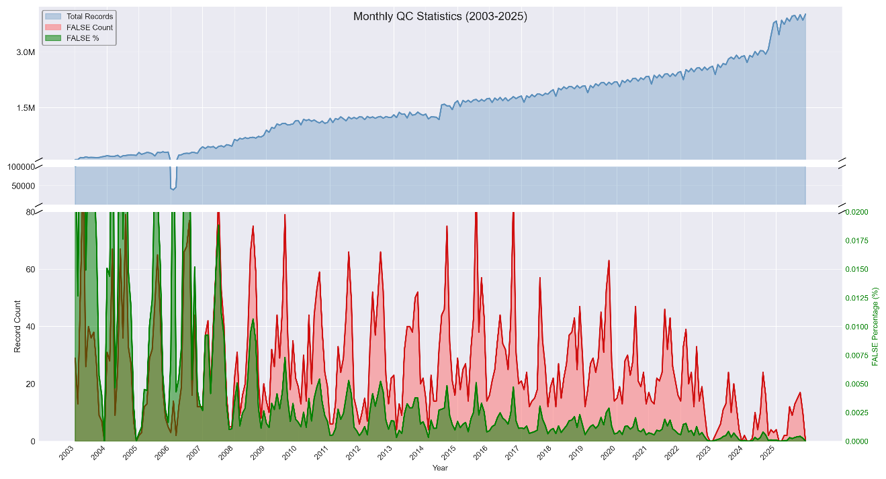
*Monthly records of the AWS archive, false records of 20 mm or more, and their share of the records of
20 mm or more over the preceding 12 months.*

## Study area and data

The study area is Guangdong Province, South China — a subtropical/tropical monsoon region
with two rainy seasons and dense station coverage (>5,000 AWSs plus 86 national
meteorological observatories by 2025).

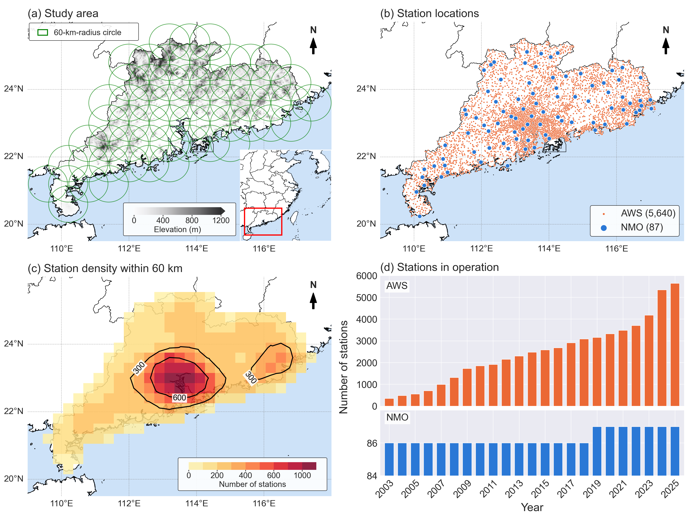
*(a) Terrain and the 60-km outlier circles of stage 1; (b) national meteorological observatories
and automatic weather stations; (c) station density within 60 km; (d) stations in operation per year.*

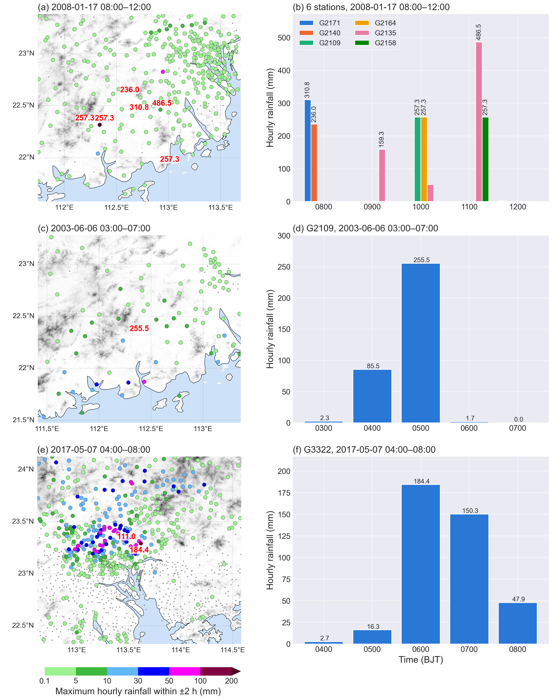
*Records used to verify the climatological hourly rainfall limit (184.4 mm): a multi-station fault
(17 January 2008), an isolated faulty record (255.5 mm), and the genuine 184.4-mm record.*

## Why sliding (not fixed) circles

A single fixed neighborhood circle can miss the core of a rainfall event and wrongly reject
a genuine extreme. Sliding the circle (finer step = fewer false negatives, at the cost of a
small increase in false positives) substantially improves recovery of true extremes.

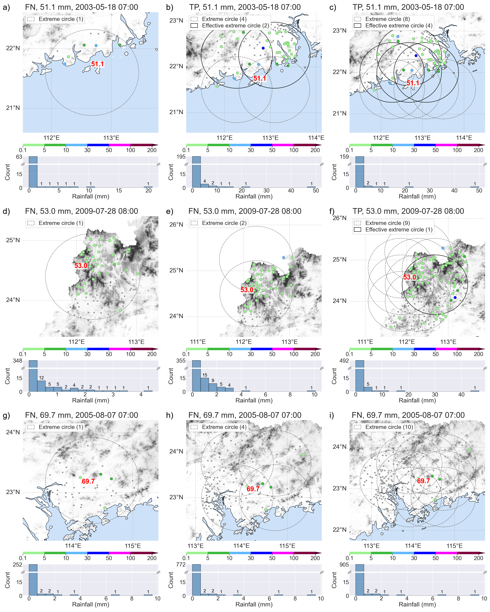
*QC result for a true extreme using a single fixed neighborhood (a, d, g), coarse-step
sliding circles (b, e, h), and fine-step sliding circles (c, f, i).*

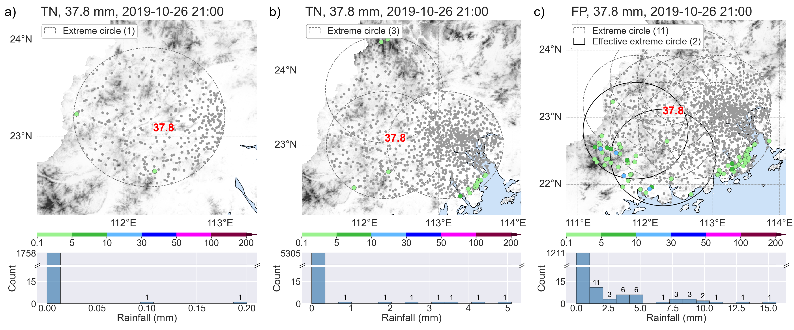
*A false target incorrectly accepted as an extreme by sliding circles, comparing a single
fixed circle (a), coarse-step (b), and fine-step (c) sliding circles.*

## Misclassified cases and radar QPE cross-validation

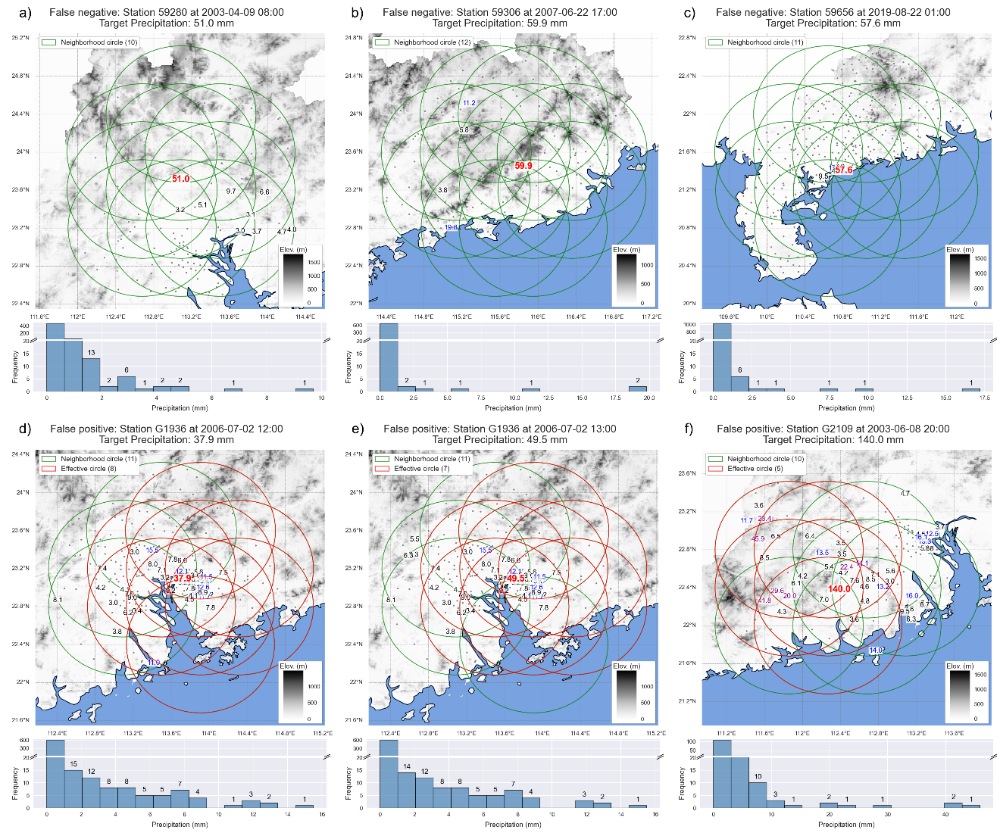
*Genuine records rejected (a–c) and false records accepted (d–f) on the test set.*

Radar quantitative precipitation estimation (QPE) data provide independent corroboration for
ambiguous cases, e.g. isolated, fast-moving coastal convective cells that the gauge network
alone cannot confirm.

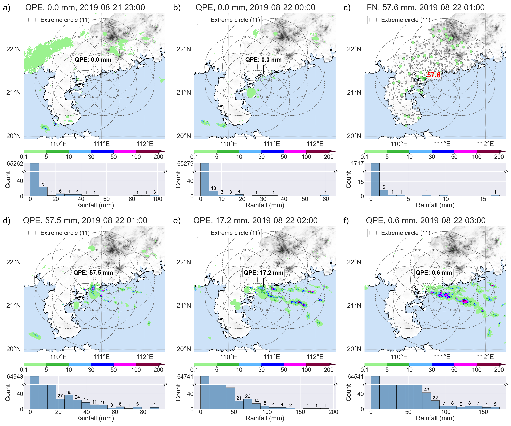
*A genuine training record rejected by the method, validated by radar QPE (2019-08-21 23:00–2019-08-22
03:00): the gauge network shows little corroborating evidence, but QPE reveals a compact
convective cell directly over the target station.*

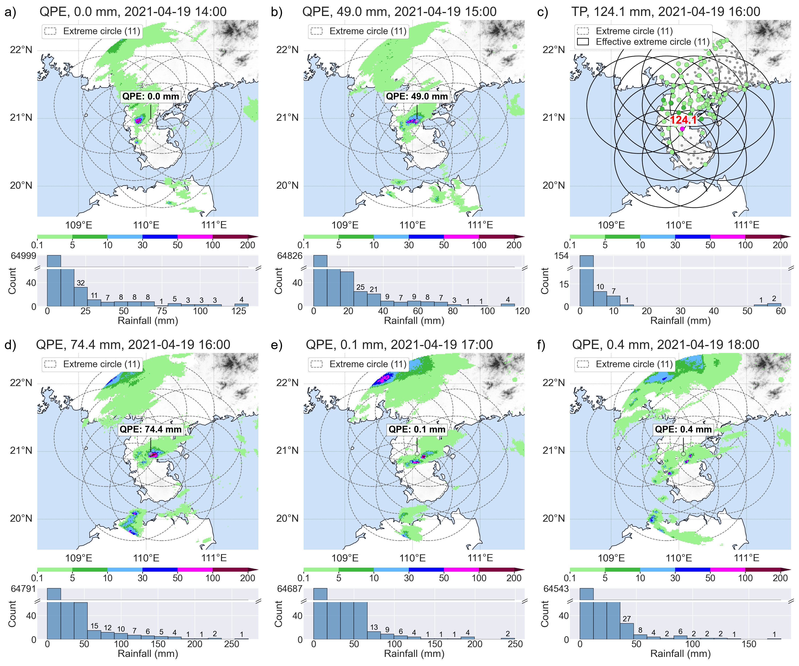
*A true-positive (TYPE2) extreme validated by radar QPE (2021-04-19 14:00–18:00).*

## Manuscript tables

All tables of the manuscript. The result tables (5–14) can be reproduced with the scripts named in their
captions (see [Scripts](#scripts)). FN = genuine records rejected; FP = false records accepted.

### Assessment metrics (Section 2d)

**Table 1.** Confusion matrix of the QC result.

| | Predicted: true | Predicted: false |
|---|---|---|
| Actual: true | True Positive (TP) | False Negative (FN) |
| Actual: false | False Positive (FP) | True Negative (TN) |

**Table 2.** Assessment metrics, their definition and formula.

| Metric | Definition | Formula |
|---|---|---|
| Accuracy | The ratio of correct predictions to total predictions. | (TP + TN) / (TP + TN + FP + FN) |
| Precision | Out of all the instances the method predicted as positive, how many were actually correct? | TP / (TP + FP) |
| Sensitivity | Out of all the actual positive instances in the data, how many did the method manage to find? | TP / (TP + FN) |
| Specificity | Out of all the actual false records, how many did the method flag as false? | TN / (TN + FP) |

### Method settings (Section 3)

**Table 3.** Parameter settings of the iterative extreme inspection. If the target is a national
meteorological observatory (NMO), the TCS threshold is lower by 1, since NMO data are more reliable.

| Inspection iteration | TCS threshold | Confidence coefficient | QC label |
|---|---|---|---|
| 1st | 2 | 0.5 | EXTREME_TYPE1 |
| 2nd | 3 | 0.4 | EXTREME_TYPE2 |
| 3rd | 4 | 0.3 | EXTREME_TYPE3 |
| 4th | 5 | 0.2 | EXTREME_TYPE4 |
| 5th | 6 | 0.1 | EXTREME_TYPE5 |

**Table 4.** Settings generating the outlier circles and extreme circles (circle counts cover the whole
study area) — `01_generate_neighbor_circles.py`.

| Circle radius (km) | Outlier circle: space gap (°) | Outlier circle: count | Extreme circle: space gap (°) | Extreme circle: count |
|---|---|---|---|---|
| 10 | 0.1 | 425 | 0.05 | 1687 |
| 20 | 0.2 | 300 | 0.1 | 1226 |
| 30 | 0.3 | 181 | 0.15 | 729 |
| 40 | 0.4 | 112 | 0.2 | 461 |
| 50 | 0.5 | 78 | 0.25 | 319 |
| 60 | 0.6 | 60 | 0.3 | 233 |
| 70 | 0.7 | 51 | 0.35 | 193 |
| 80 | 0.8 | 41 | 0.4 | 151 |
| 90 | 0.9 | 33 | 0.45 | 127 |
| 100 | 1 | 27 | 0.5 | 111 |

### Climatological hourly rainfall limit (Section 4a)

**Table 5.** The top 10 records labeled genuine by stage 2 (50-km extreme circles, neighbor values up to
400 mm) among all hourly records above 100 mm in 2003–2025 — `03_qc_check_climate_limit.py`. The
2008-01-17 cluster and the 255.5-mm record are faulty (see the manuscript); 184.4 mm is the limit.

| Station | Time (BJT) | Rainfall (mm) | QC label |
|---|---|---|---|
| G2135 | 2008-01-17 11:00 | 486.5 | EXTREME_TYPE1 |
| G2171 | 2008-01-17 08:00 | 310.8 | EXTREME_TYPE1 |
| G2109 | 2008-01-17 10:00 | 257.3 | EXTREME_TYPE1 |
| G2158 | 2008-01-17 11:00 | 257.3 | EXTREME_TYPE1 |
| G2164 | 2008-01-17 10:00 | 257.3 | EXTREME_TYPE1 |
| G2109 | 2003-06-06 05:00 | 255.5 | EXTREME_TYPE5 |
| G2140 | 2008-01-17 08:00 | 236.0 | EXTREME_TYPE1 |
| G3322 | 2017-05-07 06:00 | 184.4 | EXTREME_TYPE1 |
| G9260 | 2015-08-14 17:00 | 174.4 | EXTREME_TYPE4 |
| G9502 | 2020-05-22 03:00 | 167.8 | EXTREME_TYPE1 |

### Parameter tuning (Section 4b, training set)

**Table 6.** False records of 10 mm or more (2,231 records; 242 false) accepted as normal by stage 1, for
outlier circle radii and IQR multipliers k — `04_qc_tune_outlier_radius_multiplier.py`.

| Outlier circle radius (km) | k = 1 | k = 3 | k = 4 | k = 10 | k = 15 | k = 50 | k = 100 |
|---|---|---|---|---|---|---|---|
| 10 | 132 | 136 | 136 | 136 | 137 | 138 | 138 |
| 20 | 120 | 140 | 140 | 141 | 141 | 141 | 142 |
| 30 | 52 | 81 | 81 | 82 | 82 | 87 | 89 |
| 40 | 7 | 12 | 12 | 13 | 14 | 16 | 20 |
| 50 | 12 | 13 | 14 | 14 | 14 | 20 | 23 |
| 60 | 6 | 6 | 7 | 7 | 7 | 10 | 14 |
| 70 | 6 | 6 | 6 | 6 | 7 | 12 | 17 |
| 80 | 6 | 6 | 6 | 7 | 8 | 12 | 15 |
| 90 | 6 | 6 | 7 | 7 | 7 | 12 | 15 |
| 100 | 5 | 5 | 5 | 7 | 8 | 10 | 14 |

**Table 7.** Single check applied to every outlier (100-km outlier circles, k = 3), by intensity range:
false records reaching stage 2, false records missed with single-check circles of 10–80 km, and genuine
records rejected with 10- and 20-km circles (share of the genuine records of the range) —
`05_qc_tune_single_check.py`.

| Intensity (mm) | False records | Missed, 10 km | 20 km | 30 km | 50 km | 80 km | Genuine rejected, 10 km | 20 km |
|---|---|---|---|---|---|---|---|---|
| 1–5 | 32 | 1 | 1 | 2 | 4 | 8 | 39 (10.8%) | 12 (3.3%) |
| 5–10 | 15 | 0 | 0 | 1 | 1 | 2 | 48 (13.3%) | 20 (5.6%) |
| 10–15 | 13 | 0 | 0 | 0 | 1 | 2 | 36 (16.4%) | 17 (7.7%) |
| 15–20 | 4 | 0 | 0 | 0 | 0 | 0 | 27 (19.3%) | 12 (8.6%) |
| 1–20 (total) | 64 | 1 | 1 | 3 | 6 | 12 | 150 (13.9%) | 61 (5.6%) |
| 20–30 | 15 | 1 | 1 | 1 | 1 | 2 | 95 (26.4%) | 36 (10.0%) |
| 30–40 | 12 | 0 | 0 | 0 | 0 | 0 | 79 (30.9%) | 28 (10.9%) |
| 40–50 | 3 | 0 | 0 | 0 | 0 | 0 | 25 (24.0%) | 14 (13.5%) |
| 50–100 | 38 | 0 | 0 | 0 | 0 | 0 | 309 (34.8%) | 175 (19.7%) |
| > 100 | 152 | 0 | 0 | 0 | 0 | 0 | 10 (50.0%) | 8 (40.0%) |

**Table 8.** FN / FP on the training records of 20 mm or more (n = 1,854; 1,629 true; 225 false) for
outlier and extreme circle radii. FP counts the false records accepted by stage 2; those accepted by
stage 1 (6 at outlier radii of 60–90 km and 5 at 100 km) are not counted —
`06_qc_tune_outlier_extreme_radius.py`.

| Extreme circle radius (km) | Outlier 60 km | 70 km | 80 km | 90 km | 100 km |
|---|---|---|---|---|---|
| 10 | 345 / 2 | 387 / 2 | 397 / 2 | 423 / 2 | 449 / 3 |
| 20 | 107 / 5 | 124 / 5 | 117 / 5 | 128 / 5 | 137 / 6 |
| 30 | 32 / 6 | 41 / 6 | 40 / 6 | 43 / 6 | 49 / 7 |
| 40 | 19 / 9 | 27 / 9 | 26 / 9 | 31 / 9 | 31 / 10 |
| 50 | 12 / 10 | 18 / 10 | 17 / 10 | 22 / 10 | 22 / 11 |
| 60 | 8 / 11 | 14 / 11 | 13 / 11 | 17 / 11 | 17 / 12 |
| 70 | 7 / 11 | 10 / 11 | 10 / 11 | 13 / 11 | 13 / 12 |
| 80 | **5 / 12** | 8 / 12 | 8 / 12 | 11 / 12 | 11 / 13 |
| 90 | 4 / 14 | 7 / 14 | 7 / 14 | 10 / 14 | 10 / 15 |
| 100 | 4 / 16 | 6 / 16 | 6 / 16 | 9 / 16 | 9 / 17 |

**Table 9.** Training records of 20 mm or more confirmed by stage 2 in each iteration —
`07_qc_tune_iterations.py`.

| Actual | TYPE1 | TYPE2 | TYPE3 | TYPE4 | TYPE5 | Total |
|---|---|---|---|---|---|---|
| TRUE | 941 | 8 | 5 | 5 | 4 | 963 |
| FALSE | 3 | 0 | 2 | 4 | 3 | 12 |

**Table 10.** Labels of the training records of 20 mm or more that reached stage 2, with one setting of
the iterative inspection changed at a time; the adopted setting is in the last two rows. TYPE1–TYPE5 give
the iteration in which a record was accepted; FALSE in the TRUE rows is FN, and the TYPE columns of the
FALSE rows sum to FP — `08_qc_tune_circle_step.py`, `09_qc_tune_confidence_coefficient.py`,
`10_qc_tune_tcs_threshold.py`, `11_qc_tune_neighbor_window.py`.

| Experiment | Setting | Actual | TYPE1 | TYPE2 | TYPE3 | TYPE4 | TYPE5 | FALSE |
|---|---|---|---|---|---|---|---|---|
| Circle step | One fixed circle | TRUE | 919 | 8 | 9 | 6 | 10 | 16 |
| | | FALSE | 3 | 0 | 1 | 2 | 4 | 209 |
| | 0.8° step | TRUE | 938 | 8 | 4 | 5 | 6 | 7 |
| | | FALSE | 3 | 0 | 2 | 3 | 3 | 208 |
| CC (start → end) | 0.6 → 0.2 | TRUE | 917 | 12 | 10 | 10 | 9 | 10 |
| | | FALSE | 2 | 0 | 0 | 2 | 4 | 211 |
| | 0.7 → 0.3 | TRUE | 892 | 13 | 9 | 11 | 13 | 30 |
| | | FALSE | 1 | 0 | 0 | 0 | 2 | 216 |
| Initial TCS | 1 | TRUE | 968 | 0 | 0 | 0 | 0 | 0 |
| | | FALSE | 7 | 1 | 1 | 4 | 3 | 203 |
| | 3 | TRUE | 912 | 14 | 14 | 13 | 7 | 8 |
| | | FALSE | 1 | 0 | 2 | 4 | 4 | 208 |
| Neighbor time window | ±0 h | TRUE | 869 | 10 | 9 | 13 | 21 | 46 |
| | | FALSE | 1 | 0 | 0 | 2 | 2 | 214 |
| | ±1 h | TRUE | 928 | 8 | 5 | 9 | 5 | 13 |
| | | FALSE | 2 | 0 | 2 | 2 | 2 | 211 |
| **Adopted** | 0.4° step, CC 0.5 → 0.1, TCS 2, ±2 h | TRUE | 941 | 8 | 5 | 5 | 4 | 5 |
| | | FALSE | 3 | 0 | 2 | 4 | 3 | 207 |

**Table 11.** The tuned parameters of the QC method (`ADOPTED` in `src/qc_tuning.py`).

| Parameter | Value | Parameter | Value |
|---|---|---|---|
| Outlier circle radius (km) | 60 | Outlier circle step (°) | 0.6 |
| Multiplier k for IQR | 3 | Intensity boundary of the single check (mm) | 20 |
| Neighboring hour below 20 mm (h) | ±0 | Circle radius below 20 mm (km) | 20 |
| Circle step below 20 mm (°) | 0.1 | Inspection iterations below 20 mm | 1 |
| Extreme circle radius for 20 mm or more (km) | 80 | Extreme circle step (°) | 0.4 |
| Neighboring hour (h) | ±2 | Extreme inspection iterations | 5 |
| Initial confidence coefficient | 0.5 | Confidence coefficient step | −0.1 |
| Initial total confidence score (TCS) | 2 | TCS step | +1 |

### Validation and benchmark (Section 4c, test set)

**Table 12.** QC result statistics on the test set — `12_qc_evaluate.py`.

| Test records | FP | FN | TP | TN | Accuracy | Precision | Sensitivity | Specificity |
|---|---|---|---|---|---|---|---|---|
| < 20 mm (n = 767) | 4 | 21 | 699 | 43 | 0.967 | 0.994 | 0.971 | 0.915 |
| ≥ 20 mm (n = 1,235) | 10 | 5 | 1,081 | 139 | 0.988 | 0.991 | 0.995 | 0.933 |
| All (n = 2,002) | 14 | 26 | 1,780 | 182 | 0.980 | 0.992 | 0.986 | 0.929 |

**Table 13.** Performance on the test set by hourly rainfall intensity: sensitivity (NMO records) and
specificity (AWS false records) with 95% Wilson confidence intervals — `12_qc_evaluate.py`.

| Bin (mm) | TP | FN | Sensitivity (95% CI) | TN | FP | Specificity (95% CI) |
|---|---|---|---|---|---|---|
| 1–5 | 235 | 5 | 0.979 (0.952–0.991) | 23 | 3 | 0.885 (0.710–0.960) |
| 5–10 | 233 | 7 | 0.971 (0.941–0.986) | 10 | 0 | 1.000 (0.723–1.000) |
| 10–20 | 231 | 9 | 0.963 (0.930–0.980) | 10 | 1 | 0.909 (0.623–0.984) |
| 20–30 | 240 | 0 | 1.000 (0.984–1.000) | 8 | 2 | 0.800 (0.490–0.943) |
| 30–50 | 238 | 2 | 0.992 (0.970–0.998) | 10 | 2 | 0.833 (0.552–0.953) |
| 50–100 | 590 | 3 | 0.995 (0.985–0.998) | 20 | 5 | 0.800 (0.609–0.911) |
| > 100 | 13 | 0 | 1.000 (0.772–1.000) | 101 | 1 | 0.990 (0.947–0.998) |

**Table 14.** FN / FP on the test set by the Madsen–Allerup (MA) method with k = 2 (Vejen et al. 2002),
k = 4 (Jiang et al. 2015) and k = 80 (tuned on the training set), and by the proposed method —
`13_qc_benchmark_madsen_allerup.py`.

| Bin (mm) | n (true / false) | MA, k = 2 | MA, k = 4 | MA, k = 80 | Proposed |
|---|---|---|---|---|---|
| 1–5 | 240 / 26 | 39 / 2 | 24 / 2 | 6 / 4 | 5 / 3 |
| 5–10 | 240 / 10 | 56 / 0 | 33 / 0 | 8 / 1 | 7 / 0 |
| 10–20 | 240 / 11 | 74 / 0 | 40 / 1 | 12 / 1 | 9 / 1 |
| 20–30 | 240 / 10 | 83 / 0 | 51 / 0 | 17 / 0 | 0 / 2 |
| 30–50 | 240 / 12 | 119 / 1 | 56 / 1 | 8 / 1 | 2 / 2 |
| 50–100 | 593 / 25 | 304 / 0 | 177 / 0 | 39 / 0 | 3 / 5 |
| > 100 | 13 / 102 | 6 / 0 | 2 / 0 | 0 / 0 | 0 / 1 |
| All | 1,806 / 196 | 681 / 3 | 383 / 4 | 90 / 7 | 26 / 14 |

## Project Structure
| Folder | Contents |
|---|---|
| `src/` | Core library: the QC method and shared utilities. Imported by the scripts, not run directly. |
| `scripts/` | Runnable entry points built on `src/`: `01`–`19` run on the shared data; the local data-preparation scripts (`9xx`) are not published (see [Scripts](#scripts)). |
| `data/` | Prepared inputs: station list, labeled samples, training/test sets, malfunction periods, neighborhood circles, external data (DEM, boundaries, radar QPE) and the cached neighbor rainfall (`data/cache/`). Only the demonstration data listed in [Data availability](#data-availability) are included. |
| `outputs/tables/` | Result tables: `tuning/` (training set; `tuning/stage2/` holds the stage-2 labels of every setting), `validation/` (test set), `application/` (full archive), `climate_limit/`. Only the tables that figures need but only the database can produce are included. |
| `outputs/figures/` | Figures written by the scripts (not included; the scripts recreate them). |
| `manuscript_figures/` | Figures of the submitted manuscript, shown in this README. |
| `demo_figures/` | Animations of the two QC stages, shown at the top of this README (stage 1 for four observed hours, stage 2 with synthetic data). |
| `docs/` | Manuscript and notes. Ignored by Git. |

### Core modules (`src/`)
| Module | Purpose |
|---|---|
| `qc_algorithms.py` | The QC method: IQR-based outlier detection with sliding outlier circles (stage 1), iterative extreme inspection with the total confidence score (stage 2), and the constants of the single check below 20 mm. Thresholds and iteration schedules are function arguments with the tuned values as defaults. |
| `qc_evaluation.py` | QC of a single labeled record (stages 1 + 2, two-segment), exact stage-1 acceptance per multiplier, confusion counts and metrics, metrics per rainfall-intensity bin with Wilson 95% confidence intervals, and the evaluation of all labeled records on the cached data. |
| `qc_tuning.py` | Shared machinery of the tuning scripts `04`–`11`: the adopted parameter set (`ADOPTED`), the cached stage-2 runs (computed on request), the combination with the stage-1 result, and the FN / FP and label counts. |
| `qc_benchmarks.py` | Benchmark checks for comparison: the Madsen–Allerup median/IQR spatial check (Vejen et al. 2002) on the nearest reporting stations. |
| `qc_data_loader.py` | Database access (Oracle), station and circle files, the parquet cache of neighbor rainfall (`AdjacentPrecipSource` reads the cache and falls back to the database), QC result files and radar QPE. |
| `qc_circle_process_utils.py` | Selecting the circles that contain a station, map extents for case figures, and rebuilding the effective (confirming) circles of a result. |
| `qc_plot_utils.py` | Shared figure style: font sizes, figure sizes (case figures 4 in wide, full-page figures 12 in wide), DEM shading, rainfall color classes, extreme-circle styles, and the map + colorbar + histogram layout of case figures. |

## Scripts
The scripts fall into two groups:

- **`01`–`19`: run with the shared data.** They need only the files of this repository, including the
  cached neighbor rainfall, and are numbered in the order they are run.
- **`901`–`912`: local data preparation (not published).** They extract the data from the Oracle
  database, build the labeled samples, cut the radar QPE snippets, cache the neighbor rainfall, apply
  the method to the full archive, and assemble the multi-panel manuscript figures; they need the database or data that cannot be published. Their outputs needed by
  `01`–`19` are included (see [Data availability](#data-availability)).

Run scripts from anywhere, e.g. `python scripts/12_qc_evaluate.py`. Each script starts with `import _bootstrap`, which puts the project root on `sys.path`
so that `from src.<module> import ...` works. All published scripts run on local files, including the
cached neighbor rainfall; scripts marked *database fallback* would query a database only if the cache
were missing (connection settings in `scripts/config_db.ini`, see `scripts/config_db.template.ini`).
Settings such as the dataset or case type are constants at the top of each script.

### 1. Labels and neighborhoods
| Script | Data | What it does |
|---|---|---|
| `01_generate_neighbor_circles.py` | offline | Outlier and extreme neighborhood circles (centers on a grid, stations within each radius) for radii of 10–100 km. |
| `02_check_false_label_nmo_support.py` | offline | Verifies the false labels: exceedances are false by definition; a malfunction-period record is kept only if at least one NMO lies within 30 km and all of them recorded < 1 mm within ±1 h. |

The labels were prepared as described in [Labeled data](#labeled-data) with the local scripts `901`–`906` (`906` writes the false pool checked by `02`, then draws and splits the training and test sets included here).

### 2. Climatological limit
| Script | Data | What it does |
|---|---|---|
| `03_qc_check_climate_limit.py` | offline (database fallback) | Stage-2 inspection of all records above 100 mm with a relaxed neighbor limit, to verify the climatological hourly rainfall limit (184.4 mm). |

### 3. Parameter tuning (training set; one script per subsection of Section 4b)
| Script | Section | What it does |
|---|---|---|
| `04_qc_tune_outlier_radius_multiplier.py` | 4b(1), Table 6 | Stage 1 of every training record for outlier circle radii of 10–100 km and IQR multipliers k = 1–100 (exact fence comparison); false records of 10 mm or more accepted by stage 1. The per-record result is read by `05`–`11`. |
| `05_qc_tune_single_check.py` | 4b(2), Table 7 | Single check applied to every outlier (100-km outlier circles), by intensity range: false records missed with circles of 10–80 km and genuine records rejected. |
| `06_qc_tune_outlier_extreme_radius.py` | 4b(3), Table 8 | FN / FP of the iterative inspection for outlier circle radii of 60–100 km and extreme circle radii of 10–100 km. |
| `07_qc_tune_iterations.py` | 4b(4), Table 9 | Records confirmed in each iteration, and FN / FP if the inspection stopped after 1–5 iterations. |
| `08_qc_tune_circle_step.py` | 4b(5), Table 10 | One fixed circle, a coarse (0.8°) and a fine (0.4°) sliding step; also writes the per-record results read by `16_plot_cases_circle_gap_comparison.py` and `17_plot_cases_by_qc_label.py`. |
| `09_qc_tune_confidence_coefficient.py` | 4b(6), Table 10 | Initial confidence coefficient (CC₀ = 0.5, 0.6, 0.7). |
| `10_qc_tune_tcs_threshold.py` | 4b(7), Table 10 | Initial TCS threshold (1, 2, 3). |
| `11_qc_tune_neighbor_window.py` | 4b(8), Table 10 | Neighbor time window (±0, ±1, ±2 h). |

Each tuning script lists the candidate values of its parameter at the top and keeps the other
parameters at their adopted values (`ADOPTED` in `src/qc_tuning.py`), so a parameter can be re-tuned
by editing one line and running one script. Stage 2 is run once per setting with every record sent to
stage 2, and combined with the stage 1 result of `04` (a record accepted by stage 1 is NORMAL, otherwise
it keeps its stage 2 label). The stage 2 runs are cached in `outputs/tables/tuning/stage2/` under file
names that spell out their parameters; the runs of the manuscript are included, so the scripts finish in
seconds. A new setting is run first (about 30–40 min each, `N_WORKERS` = 2 processes in parallel). The
tables are written to `outputs/tables/tuning/table*.csv`.

### 4. Evaluation and benchmark
| Script | Data | What it does |
|---|---|---|
| `12_qc_evaluate.py` | offline (database fallback) | Runs the tuned method on the test set (default) or the training set; saves labels, confusion metrics, label counts and metrics per rainfall-intensity bin (Tables 12–13). |
| `13_qc_benchmark_madsen_allerup.py` | offline | Madsen–Allerup check (12 nearest neighbors, \|T\| > k; k tuned on the training set, plus literature values 2 and 4) against the proposed method on the test set, per intensity bin (Table 14). Needs the results of `12_qc_evaluate.py`. |

### 5. Figures (written to `outputs/figures/`)
| Script | Data | Figure |
|---|---|---|
| `14_plot_study_area.py` | offline | Study area (terrain, neighborhood circles, location inset), station locations, station density and stations in operation per year (Fig. 1). |
| `15_plot_climate_limit_cases.py` | offline | Neighbor rainfall maps and hourly series of the cases used to verify the climatological limit (Fig. 3). |
| `16_plot_cases_circle_gap_comparison.py` | offline (database fallback) | The same training cases drawn with a single fixed circle, coarse-step and fine-step sliding circles (panels of Figs. 4–5). |
| `17_plot_cases_by_qc_label.py` | offline (database fallback) | One map + histogram per case of a chosen QC outcome (FN/FP, or TYPE1–5) of the training or test set (panels of Figs. 6–8). |
| `18_plot_cases_radar_qpe.py` | offline | Hourly radar QPE maps around selected cases (panels of Figs. 7–8). |
| `19_plot_history_monthly_statistics.py` | offline | Monthly record counts and FALSE records of the full archive, 2003–2025 (Fig. 9). |

### 6. Local data preparation (not published)
| Script | What it does |
|---|---|
| `901_extract_station_locations.py` | Station list of Guangdong (NMOs and AWSs) with coordinates and start dates. |
| `902_extract_validation_data.py` | NMO records ≥ 30 mm (true) and AWS records above the climatological limit (false). |
| `903_derive_malfunction_periods.py` | Malfunction periods from the AWS exceedances: consecutive exceedances at a station at most 14 days apart form one period. |
| `904_extract_validation_malfunction_periods.py` | AWS records of 30–184.4 mm within the malfunction periods. |
| `905_extract_validation_low_intensity.py` | NMO records of 1–30 mm and AWS records of 1–30 mm within the malfunction periods. |
| `906_build_validation_sets.py` | False pool for the label check (`02`); sampling and 6:4 split into the training and test sets. |
| `907_extract_extreme_records.py` | All hourly records above 100 mm (`data/gd_extreme_data.csv`). |
| `908_extract_qpe_case_snippets.py` | Cuts the radar QPE snippets of the plotted cases (`data/external/qpe_cases/`) from the monthly files. |
| `909_cache_neighbor_rainfall.py` | Caches the hourly rainfall of all stations within ±2 h of every sample (`data/cache/`). |
| `910_qc_apply_aws_history.py` | Applies the tuned method to the full AWS archive (2003–2025); labels and monthly statistics. |
| `911_qc_flag_malfunction_errors.py` | Temporal-consistency step: flags the confirmed false records ≥ 20 mm of the malfunction periods. |
| `912_plot_mosaic.py` | Assembles the case panels of scripts `16`–`18` into the multi-panel Figs. 4–8 of the manuscript. |

Full-page figures are 12 in wide and case figures 4 in wide (three per row), all with the font sizes
defined in `src/qc_plot_utils.py`.

## Data availability
The full hourly observational archive is not open access due to meteorology regulations in China.
This repository includes a small subset **for demonstrating this project only; it may not be used for
any other purpose.** It is sufficient to run every script of this repository without database access:

| Data | Contents |
|---|---|
| `data/gd_stations_locations.csv` | Station codes, coordinates, types and start dates |
| `data/gd_validation_data_{train,test}.csv` | Labeled training and test samples |
| `data/gd_malfunction_periods.csv`, `data/gd_validation_false_pool.csv` | Malfunction periods and the false records of the labeled pool |
| `data/gd_extreme_data.csv`, `data/qc_result_test_qpe_plotting.csv` | Records above 100 mm; cases plotted with radar QPE |
| `data/neighbor_circles_{outlier,extreme}/` | Neighborhood circles (10–100 km) |
| `data/cache/*.parquet` | Hourly rainfall of all stations within ±2 h of each sample (training set, test set, false pool, records above 100 mm) |
| `data/external/basemap/` | Provincial boundaries and the 1-km DEM used by the maps |
| `data/external/qpe_cases/` | Radar QPE snippets of the plotted cases |
| `outputs/tables/climate_limit/`, `outputs/tables/tuning/`, `outputs/tables/validation/qc_result_test_*.csv` | Results of scripts 03, 04, 08 and 12 read by the later scripts (climate-limit inspection, stage-1 results, cached stage-2 runs, per-record results), so that each script also runs on its own |
| `outputs/tables/validation/qc_false_label_nmo_support.csv` | Verification of the false labels (written by `02_check_false_label_nmo_support.py`) |
| `outputs/tables/application/qc_monthly_statistics_2003-2025_5mm.csv` | Monthly statistics of the full archive (produced with database access), read by `19_plot_history_monthly_statistics.py` |

Scripts that need the database or unpublished data are not included.
