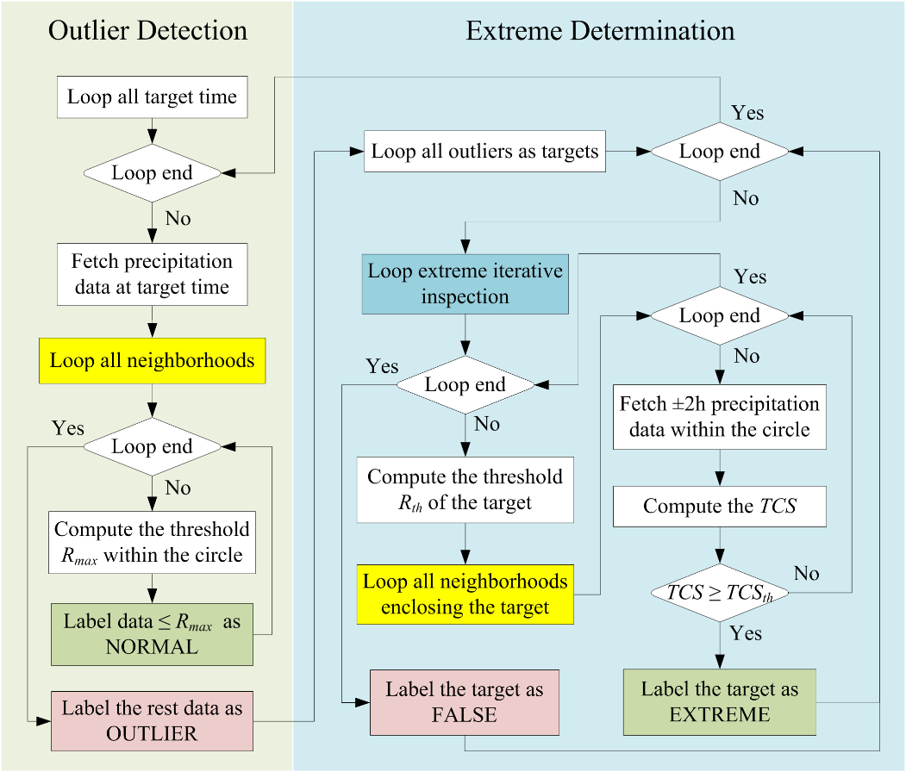
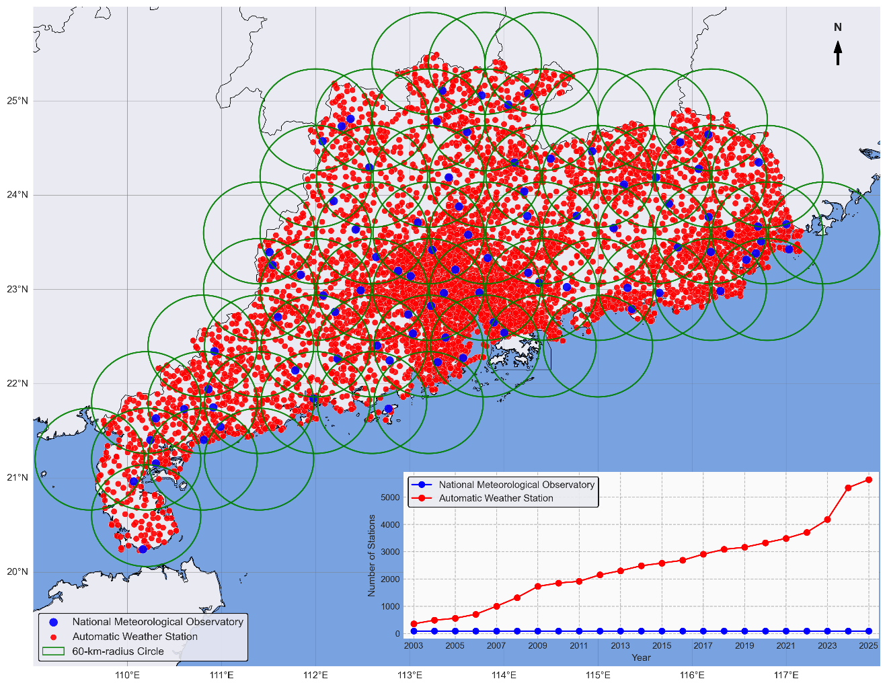
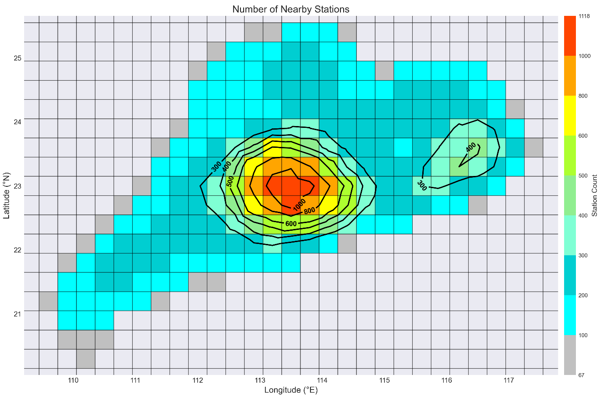
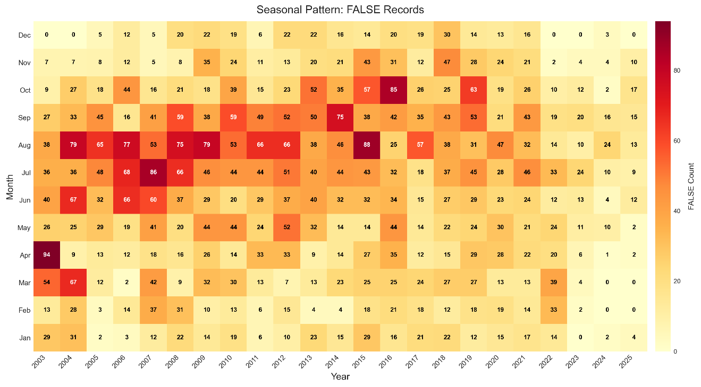

# Scripts for hourly precipitation quality control

## Description
The main purpose of this project is to prepare the datasets and have them checked
using our novel method and methods proposed by previous researchers.

Since the original hourly data are stored in Oracle 19c, connection to Oracle is required.
Using sqlAlchemy's thin mode, Oracle database can be connected without Oracle client.
After the quality inspection, all referenced data used to check the quality of target data
will be saved to a local directory.
The intermediate results, final tables, and figures will be saved locally as well.

The method and results are described in the manuscript *"An Iterative Spatial Consistency
Quality Control Method for In Situ Hourly Precipitation Observations"*, submitted to the
*Journal of Hydrometeorology* (JHM). A summary of the method, workflow, and key results is
given below; the figures referenced here are reproduced from the manuscript in
[`manuscript_figures/`](manuscript_figures/).

## Method overview

Existing spatial-consistency QC methods pool all neighboring observations into a single
ordered sequence and compare the target against one fixed threshold in a single pass. This
tends to misclassify genuine localized extreme rainfall as erroneous. This project proposes
a two-stage **iterative spatial consistency QC method** that instead treats each neighboring
station as an independent line of evidence and relaxes its acceptance criterion over several
rounds:

1. **Stage 1 — Outlier identification.** For each target hour, sliding neighborhood ("outlier")
   circles are used to compute an IQR-based upper bound `R_max` from co-temporal neighbor
   observations. Values below `R_max` are accepted as normal; the rest are flagged as
   candidate outliers for Stage 2.
2. **Stage 2 — Iterative extreme inspection.** Each outlier is checked against neighboring
   station records within ±2 hours, using a series of sliding ("extreme") circles. A total
   confidence score (TCS) is accumulated from qualifying neighbors and compared against an
   iteration-specific threshold that relaxes over up to 5 rounds (confidence coefficient
   0.5 → 0.1, TCS threshold 2 → 6). An outlier that clears the threshold in round *k* is
   labeled `EXTREME_TYPEk` (genuine extreme); one that never clears it is labeled false.

A complementary **manual temporal-consistency QC** step then flags station-months with
clustered false records (malfunction periods) and reclassifies nearby borderline records
within ±12 h as erroneous.

*Fig. 1 — Flow chart of the QC method (outlier detection, left; iterative extreme
determination, right).*

### Tuned parameters

| Parameter | Value |
|---|---|
| Outlier circle radius / step | 60 km / 0.6° |
| Extreme circle radius / step | 80 km / 0.4° |
| Neighboring validation window | target hour ± 2 h |
| Iterations | 5 |
| Initial confidence coefficient / step | 0.5 / −0.1 |
| Initial TCS threshold / step | 2 / +1 |

### Validation performance (independent test set, n = 1,000)

| FP | FN | TP | TN | Accuracy | Precision | Sensitivity | F1 |
|---|---|---|---|---|---|---|---|
| 3 | 3 | 866 | 128 | 0.99 | 1.00 | 1.00 | 1.00 |

Applied operationally to ~420 million AWS hourly records (2003–2025), the full inspection
completed in 17 hours on a standard workstation. False records are markedly concentrated in
the early years of the AWS network (2003–2008) and become negligible in recent years.

## Study area and data

The study area is Guangdong Province, South China — a subtropical/tropical monsoon region
with two rainy seasons and dense station coverage (>5,000 AWSs plus 86 national
meteorological observatories by 2025).

*Fig. 2 — Distribution of national meteorological observatories, automatic weather
stations, and neighborhood circles, with the temporal growth of each station type.*

*Fig. 3 — Station density within a 60-km-radius circle across the study area.*

## Why sliding (not fixed) circles

A single fixed neighborhood circle can miss the core of a rainfall event and wrongly reject
a genuine extreme. Sliding the circle (finer step = fewer false negatives, at the cost of a
small increase in false positives) substantially improves recovery of true extremes.

*Fig. 4 — QC result for a true extreme using a single fixed neighborhood (a, d, g),
coarse-step sliding circles (b, e, h), and fine-step sliding circles (c, f, i).*

*Fig. 5 — A false target incorrectly accepted as an extreme by sliding circles, comparing
a single fixed circle (a), coarse-step (b), and fine-step (c) sliding circles.*

## Misclassified cases and radar QPE cross-validation

Only 6 of 1,000 test cases were misclassified — 3 false negatives (genuine NMO extremes with
too few corroborating neighbors) and 3 false positives (AWS records confirmed spurious from
station malfunction history).

*Fig. 6 — False negative and false positive cases on the test dataset.*

Radar quantitative precipitation estimation (QPE) data provide independent corroboration for
ambiguous cases, e.g. isolated, fast-moving coastal convective cells that the gauge network
alone cannot confirm.

*Fig. 7 — A false-negative case validated by radar QPE (2019-08-21 23:00–2019-08-22 03:00):
the gauge network shows little corroborating evidence, but QPE reveals a compact convective
cell directly over the target station.*

*Fig. 8 — A true-positive (TYPE2) extreme validated by radar QPE
(2021-04-19 14:00–18:00).*

## Historical QC application (2003–2025)

*Fig. 9 — Monthly statistics of the historical QC result across the AWS network.*

*Fig. 10 — Seasonal pattern of false records identified during 2003–2025.*

## Project Structure
`__init__.py`: adding an empty `__init__.py` file gives flexibility.
`src/`: Contains Python processing scripts.
`data/`: Raw, processed, and external data (ignored by Git).
`figures/`: Output plots (ignored by Git).
`docs/`: Manuscript and supporting write-ups (ignored by Git).
`manuscript_figures/`: Figures extracted from the JHM manuscript, tracked by Git for
display in this README.

## Usage
Scripts starting with `ora_` connect Oracle database and cannot run out of the domain network;
Scripts starting with `stat_` deal with the output file saved in local directories;
Scripts starting with `plot_` produce figures based on the processed data;
`qc_algorithms.py` implements the outlier detection and iterative extreme inspection method
described above; `qc_app_aws_history.py` applies the tuned method to the full historical
AWS archive.

## Data availability
The hourly observational data are not open access due to meteorology regulations in China.
All Python scripts are available in this repository.
